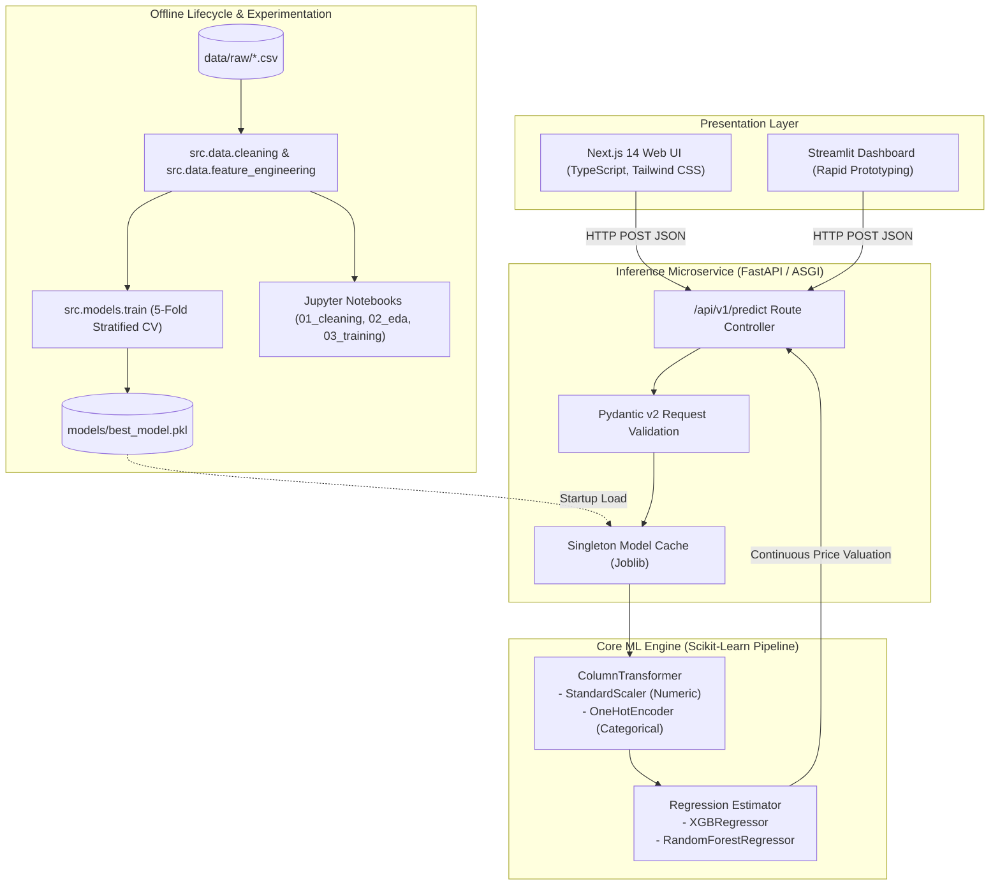

# Laptop Price Predictor: Machine Learning Scaffold and Production Architecture

A modular, production-ready machine learning project [currently a scaffold] and microservice platform designed to estimate fair market valuations for laptops based on granular hardware specifications.

This repository aims to teach data science foundations to DSAI Club Members. It standardizes the entire machine learning lifecycle: data ingestion, feature decomposition, exploratory analysis, reproducible scikit-learn pipeline engineering, REST API serving via FastAPI, dual client frontends (Next.js 14 and Streamlit), containerization via Docker, and continuous integration via GitHub Actions.


Project Status: Folder Layout Ready, Actual Work yet to start.
---

## 1. System Architecture

The project decouples the machine learning lifecycle from user-facing clients through a stateless HTTP API microservice layer.



---

## 2. Repository Layout

```
.
├── .github/
│   └── workflows/
│       ├── ci.yml                    # Automated linting and pytest matrix across Python 3.12 and 3.13
│       └── deploy.yml                # Continuous deployment and container verification workflow
├── api/
│   ├── __init__.py
│   ├── dependencies.py               # Singleton model loading and dependency injection
│   ├── main.py                       # FastAPI application entrypoint, CORS, lifespan, and health checks
│   ├── schemas.py                    # Pydantic v2 schemas defining input and output data contracts
│   └── routers/
│       ├── __init__.py
│       └── predict.py                # POST /api/v1/predict routing handler
├── data/
│   ├── raw/
│   │   └── .gitkeep                  # Directory for incoming raw CSV datasets (gitignored)
│   └── processed/
│       └── .gitkeep                  # Cleaned and feature-engineered datasets (gitignored)
├── docker/
│   ├── Dockerfile.api                # Production container definition for FastAPI microservice
│   ├── Dockerfile.frontend           # Multi-stage production container definition for Next.js 14
│   └── docker-compose.yml            # Multi-service orchestration (FastAPI, Next.js, Streamlit)
├── frontend/
│   ├── streamlit_app.py              # Exploratory Streamlit client
│   └── nextjs/                       # Production Next.js 14 web client (App Router, Tailwind CSS)
│       ├── package.json
│       ├── tsconfig.json
│       ├── next.config.js
│       ├── tailwind.config.ts
│       ├── postcss.config.js
│       └── src/
│           ├── app/
│           │   ├── layout.tsx
│           │   ├── page.tsx
│           │   └── globals.css
│           └── components/
│               ├── PredictionForm.tsx
│               └── ResultCard.tsx
├── models/
│   └── .gitkeep                      # Exported serialized model artifacts (*.pkl, gitignored)
├── notebooks/
│   ├── 01_data_cleaning.ipynb        # Ingestion, specification parsing, and duplicate handling
│   ├── 02_eda.ipynb                  # Distribution analysis, boxplots, and PPI correlation
│   └── 03_model_training.ipynb       # Pipeline assembly, CV benchmarking, and artifact export
├── src/
│   ├── __init__.py
│   ├── data/
│   │   ├── __init__.py
│   │   ├── cleaning.py               # String parsing (resolution, memory) and normalization
│   │   └── feature_engineering.py    # PPI computation, CPU tiering, and column grouping
│   ├── models/
│   │   ├── __init__.py
│   │   ├── evaluate.py               # Regression metrics: R2, MAE, RMSE, MAPE
│   │   ├── predict.py                # Pre-inference transformer and predict_price handler
│   │   └── train.py                  # Scikit-learn Pipeline construction and training loop
│   └── utils/
│       ├── __init__.py
│       └── helpers.py                # Path resolution, environment detection, and currency formatters
├── tests/
│   ├── __init__.py
│   ├── test_api.py                   # FastAPI routing, healthcheck, and schema validation tests
│   ├── test_cleaning.py              # Resolution parsing, drive breakdown, and OS normalization tests
│   ├── test_feature_engineering.py   # PPI calculation and feature grouping unit tests
│   └── test_model.py                 # Feature synthesis and model input transformation tests
├── .env.example                      # Environment variable template
├── .gitignore                        # Comprehensive Python, Node, data, and model ignore rules
├── LICENSE                           # MIT License
├── pyproject.toml                    # PEP 518/621 build configuration and dependency matrix
└── requirements.txt                  # Pinned Python dependencies
```

---

## 3. Data Specification and Input Schema

The data ingestion pipeline anticipates tabular specifications representing consumer and enterprise laptops. The default dataset source is the Kaggle Laptop Price dataset (`ironwolf437/laptop-price-dataset`).

### Expected Raw Attributes

| Column Name | Type | Description | Example Values |
|---|---|---|---|
| `Company` | string | Hardware brand | Apple, Dell, Lenovo, HP, Asus |
| `TypeName` | string | Chassis form factor | Notebook, Ultrabook, Gaming, Workstation |
| `Inches` | float | Diagonal screen dimension | 13.3, 14.0, 15.6, 17.3 |
| `ScreenResolution` | string | Unstructured display description | IPS Panel Retina Display 2560x1600, Full HD 1920x1080 |
| `CPU_Company` | string | Processor silicon manufacturer | Intel, AMD |
| `CPU_Type` | string | Processor model designation | Core i7 8550U, Ryzen 5 5600H |
| `CPU_Frequency (GHz)`| float | Base processor clock frequency | 1.8, 2.5, 2.8, 3.1 |
| `RAM (GB)` | integer | System memory capacity | 4, 8, 16, 32, 64 |
| `Memory` | string | Unstructured storage drive strings | 256GB SSD, 128GB SSD + 1TB HDD, 1.0TB Hybrid |
| `GPU_Company` | string | Graphics chip manufacturer | Intel, Nvidia, AMD |
| `GPU_Type` | string | Graphics processing unit model | GeForce GTX 1050, UHD Graphics 620 |
| `OpSys` | string | Factory operating system | Windows 10, macOS, Linux, No OS |
| `Weight (kg)` | float | Total laptop mass | 1.25, 2.05, 2.80 |
| `Price (Euro)` | float | Continuous target market valuation | 450.00, 1299.50, 2499.00 |

---

## 4. Feature Engineering and Mathematical Formulations

Raw technical specifications cannot be directly fed into regression estimators without structural transformation. `src/data/feature_engineering.py` implements the following domain transformations:

### 4.1 Pixels Per Inch (PPI)


### 4.2 Storage Decomposition


### 4.3 Processor Performance Tiering


### 4.4 Hardware Flags

---

## 5. Machine Learning Pipeline Architecture


### Feature Grouping Contract


### Evaluation Metrics

Estimator performance is evaluated across four metrics on an 80/20 train/test holdout partition, accompanied by 5-fold cross-validation:

$$\text{R}^2 = 1 - \frac{\sum (y_i - \hat{y}_i)^2}{\sum (y_i - \bar{y})^2}$$

$$\text{MAE} = \frac{1}{n}\sum_{i=1}^n |y_i - \hat{y}_i|$$

$$\text{RMSE} = \sqrt{\frac{1}{n}\sum_{i=1}^n (y_i - \hat{y}_i)^2}$$

$$\text{MAPE} = \frac{100\%}{n}\sum_{i=1}^n \left|\frac{y_i - \hat{y}_i}{y_i}\right|$$

---

## 6. REST API Specification

The FastAPI microservice serves the trained model using an OpenAPI 3.1 specification.

### 6.1 Diagnostic Endpoint

- **Route**: `GET /health`
- **Response**:
```json
{
  "status": "ok",
  "model_loaded": true
}
```

### 6.2 Price Prediction Endpoint

- **Route**: `POST /api/v1/predict`
- **Request Headers**: `Content-Type: application/json`
- **Request Body**:
```json
{
  
}
```
- **Response Body (`200 OK`)**:
```json
{
  "predicted_price": 1924.87,
  "currency": "EUR",
  "formatted_price": "€1,924.87"
}
```

- **Error Codes**:

---

## 7. Developer Quickstart

### Prerequisites
- Python 3.12 or higher
- Node.js 18 or higher (for Next.js frontend development)
- Docker and Docker Compose (optional, for containerized environments)

### 7.1 Clone and Environment Setup

```bash
# Clone the repository
git clone https://github.com/yogg-d/Laptop-Price-Predictor-Project-.git
cd Laptop-Price-Predictor-Project-

# Create and activate virtual environment
python -m venv .venv

# On Linux/macOS:
source .venv/bin/activate

# On Windows (PowerShell):
.venv\Scripts\Activate.ps1

# Upgrade package manager and install dependencies in editable mode
python -m pip install --upgrade pip
pip install -e ".[dev,streamlit]"
```

### 7.2 Dataset Placement and Pipeline Execution

Place the raw dataset in `data/raw/laptop_price - dataset.csv`. Then run the automated training script:

```bash
# Execute training pipeline
python -m src.models.train
```

Upon execution, the script evaluates model candidates and writes the serialized pipeline to `models/best_model.pkl`.

### 7.3 Launching the API Microservice

```bash
uvicorn api.main:app --host 0.0.0.0 --port 8000 --reload
```

- Swagger UI Documentation: `http://localhost:8000/docs`
- ReDoc Documentation: `http://localhost:8000/redoc`

### 7.4 Running Frontend Clients

#### Streamlit Dashboard
```bash
streamlit run frontend/streamlit_app.py
```
Accessible at `http://localhost:8501`.

#### Next.js 14 Web Application
```bash
cd frontend/nextjs
npm install
npm run dev
```
Accessible at `http://localhost:3000`.

---

## 8. Containerized Execution via Docker

A multi-service Docker Compose configuration orchestrates the backend API, Next.js frontend, and Streamlit client in isolated networks.


### Port Mapping Summary

| Service | Internal Port | Exposed Host Port | URL |
|---|---|---|---|
| FastAPI Backend | 8000 | 8000 | `http://localhost:8000` |
| Next.js Frontend | 3000 | 3000 | `http://localhost:3000` |
| Streamlit UI | 8501 | 8501 | `http://localhost:8501` |

---


---

## 11. License

This project is licensed under the MIT License. See the [LICENSE](LICENSE) file for complete terms and copyright notices.
